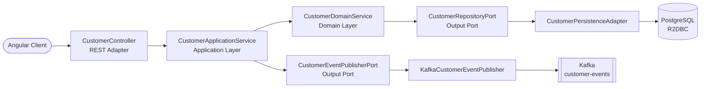

[](https://github.com/apchavez/spring-angular-fullstack-k8s/actions/workflows/ci.yml)
[](https://sonarcloud.io/summary/new_code?id=apchavez_spring-angular-fullstack-k8s)
[](https://sonarcloud.io/summary/new_code?id=apchavez_spring-angular-fullstack-k8s)
[](https://sonarcloud.io/summary/new_code?id=apchavez_spring-angular-fullstack-k8s)

# Spring Angular Fullstack K8s

Fullstack monorepo with a reactive **Spring Boot WebFlux** backend following **Hexagonal Architecture** and an **Angular 21** frontend with **Angular Material**. Event-driven with **Apache Kafka**, deployed on **Kubernetes**.

---

## Structure

```
├── api/        Spring Boot WebFlux backend (Java 21, Hexagonal Architecture)
│   └── k8s/    Kubernetes manifests (api + kafka + redis + supporting services)
├── web/        Angular 21 frontend (Angular Material, standalone components)
├── postman/    Postman collection + environments (local, k8s)
├── docker/     PostgreSQL init script
└── docker-compose.yml
```

---

## Tech Stack

### Backend (`api/`)

| Category | Technology |
|---|---|
| Language / Runtime | Java 21, Spring Boot 3.5.3 |
| Reactivity | Spring WebFlux (Mono / Flux), Spring Data R2DBC |
| Database | H2 (dev profile) / PostgreSQL 16 (prod profile) |
| Cache | Redis (reactive, rate limiting) |
| Messaging | Apache Kafka (KRaft, topic `customer-events`) |
| Security | Spring Security + JWT RS256 (oauth2-resource-server), CORS, rate limiting |
| Observability | Spring Boot Actuator, Micrometer + Prometheus, OpenTelemetry (OTLP), SLF4J + Logback, X-Request-Id |
| API Docs | Springdoc OpenAPI 2 (Swagger UI) |
| Build | Gradle 8, JaCoCo (≥ 80% on domain and application) |
| Code quality | ArchUnit, SonarCloud |

### Frontend (`web/`)

| Category | Technology |
|---|---|
| Framework | Angular 21 (standalone components) |
| UI Library | Angular Material (M3 theme) |
| HTTP | Angular HttpClient + RxJS |
| Forms | Angular Reactive Forms |
| Tests | Vitest + Angular TestBed |
| Build | Angular CLI, Docker multi-stage (nginx) |

---

## Architecture (Backend)



```
api/src/main/java/com/apchavez/customers
├── domain
│   ├── model          Customer (record with invariants), CustomerState
│   ├── exception      Typed domain exceptions
│   ├── event          CustomerEvent, CustomerEventType
│   ├── port           CustomerRepositoryPort, CustomerEventPublisherPort (interfaces)
│   └── service        CustomerDomainService (pure business logic)
├── application
│   └── CustomerApplicationService  (orchestration, audit logging, @Transactional)
└── infrastructure
    ├── config         Security, RateLimiting, RequestLogging, OpenApi, KafkaConfig, Startup
    ├── mapper         CustomerMapper (DTO ↔ Domain ↔ Entity)
    ├── messaging      KafkaCustomerEventPublisher, NoOpCustomerEventPublisher
    ├── persistence    CustomerEntity, CustomerR2dbcRepository, CustomerPersistenceAdapter
    └── web            CustomerController, DTOs (Request/Update/Response), GlobalExceptionHandler
```

**Dependency rule:** `infrastructure` → `application` → `domain`  
The domain has no knowledge of outer layers. Verified automatically by `ArchitectureTest` (ArchUnit).

---

## Getting Started

### Run everything with Docker Compose

```bash
docker compose up --build
```

- **API:** `http://localhost:8080` / Swagger UI: `http://localhost:8080/swagger-ui.html`
- **Web:** `http://localhost:4200`

### Backend only (H2 in-memory)

```bash
cd api
./gradlew bootRun
```

### Frontend only

```bash
cd web
npm install
npm start
```

---

## Postman Collection

Import `postman/spring-webflux-hexagonal-arch.postman_collection.json` into Postman.

Two environments are included:
- `postman/spring-webflux-hexagonal-arch.local.postman_environment.json` — `http://localhost:8080`
- `postman/spring-webflux-hexagonal-arch.k8s.postman_environment.json` — `http://customer-service.local`

The collection covers all CRUD endpoints, validation error cases, and an **Observability** folder with requests to `/actuator/health/liveness`, `/actuator/health/readiness`, and `/actuator/prometheus`.

---

## API Endpoints

Base path: `/api/v1/customers`

| Method | Route | Description | Responses |
|---|---|---|---|
| `POST` | `/` | Create customer | `201`, `400`, `422` |
| `GET` | `/active?page=0&size=20` | List active customers (paginated) | `200` |
| `GET` | `/{id}` | Find by ID | `200`, `404` |
| `PUT` | `/{id}` | Full update | `200`, `400`, `404`, `422` |
| `DELETE` | `/{id}` | Delete customer | `204`, `404` |

---

## Testing

### Backend
```bash
cd api && ./gradlew test
```

| Type | Class | Description |
|---|---|---|
| Domain model — unit + property-based (jqwik) | `CustomerDomainTest` | `Customer` record invariants |
| JSON serialization — property-based | `CustomerResponseDTOSerializationTest` | Round-trip without data loss |
| Domain service — unit | `CustomerDomainServiceTest` | Business logic (create/find/update/delete) |
| Application service — unit | `CustomerApplicationServiceTest` | Use case orchestration + event publishing |
| Persistence adapter — `@DataR2dbcTest` | `CustomerPersistenceAdapterTest` | Persistence port with real H2 |
| Kafka publisher — unit | `KafkaCustomerEventPublisherTest` | JSON send, Kafka failure resilience, serialization error |
| REST controller — full integration | `CustomerControllerIntegrationTest` | All endpoints and response codes |
| Rate limiter — unit | `RateLimitingFilterTest` | Per-IP limit and IP isolation |
| Actuator probes | `ActuatorHealthTest` | Liveness/Readiness |
| Hexagonal architecture — ArchUnit | `ArchitectureTest` | 4 dependency rules enforced |

### Frontend
```bash
cd web && npm test
```

| Type | Class | Description |
|---|---|---|
| Component unit | `AppSpec` | Root app creation and title |
| Service unit | `CustomerServiceSpec` | HttpClient calls, request/response mapping |
| Component unit | `CustomerListComponentSpec` | Table rendering, loading state |
| Component unit | `CustomerFormComponentSpec` | Form validation, create/edit modes |

---

## CI/CD

| Job | Trigger | What it does |
|---|---|---|
| `test-api` | Every push / PR | Compile, test, JaCoCo ≥ 80%, SonarCloud (on main) |
| `test-web` | Every push / PR | Angular tests + production build |
| `k8s-validate` | Every push / PR | Validate manifests with kubeconform |
| `docker-api` | Push to `main` | Build + push `ghcr.io/apchavez/spring-angular-fullstack-k8s-api` |
| `docker-web` | Push to `main` | Build + push `ghcr.io/apchavez/spring-angular-fullstack-k8s-web` |

---

## Kubernetes

Manifests in `api/k8s/`:

| File | Description |
|---|---|
| `namespace.yaml` | `customer-service` namespace |
| `configmap.yaml` | Non-sensitive configuration (profile, DB host, Kafka bootstrap, `OTEL_EXPORTER_OTLP_ENDPOINT`) |
| `secret.yaml` | Database credentials (base64) |
| `deployment.yaml` | 2 replicas, ghcr.io image, probes, resource limits, securityContext |
| `service.yaml` | ClusterIP on port 80 |
| `ingress.yaml` | NGINX Ingress at `customer-service.local` |
| `kafka.yaml` | Single-node Kafka (Bitnami KRaft, no Zookeeper) |
| `redis.yaml` | Redis deployment for reactive rate limiting |
| `prometheus-rule.yaml` | PrometheusRule CRD with alerting rules (requires Prometheus Operator) |
| `grafana.yaml` | Grafana deployment with pre-provisioned Prometheus datasource and dashboard |
| `hpa.yaml` | HorizontalPodAutoscaler — 2–10 replicas, scales on CPU (70%) and memory (80%) |
| `network-policy.yaml` | NetworkPolicy — restricts ingress (nginx + grafana only) and egress (postgres, redis, kafka, OTLP, DNS) |

---

## Observability

The API exposes metrics at `/actuator/prometheus` (Micrometer + Prometheus registry) and distributed traces via OpenTelemetry (OTLP exporter, configurable via `OTEL_EXPORTER_OTLP_ENDPOINT`). All requests are logged with a `X-Request-Id` correlation header.

`api/k8s/prometheus-rule.yaml` contains a `PrometheusRule` CRD (Prometheus Operator) with three alert rules:

| Alert | Severity | Condition |
|---|---|---|
| `HighErrorRate` | critical | > 5% of requests return 5xx for 2 min |
| `HighP99Latency` | warning | P99 latency > 1 s for 2 min |
| `PodNotReady` | critical | Any pod not ready for 2 min |

Requires [Prometheus Operator](https://github.com/prometheus-operator/prometheus-operator) installed in the cluster.

`api/k8s/grafana.yaml` deploys Grafana with a pre-provisioned Prometheus datasource and a dashboard covering request rate, error rate, P50/P99 latency, and JVM memory panels.

```bash
kubectl port-forward svc/grafana 3000:3000 -n customer-service
```

---

## Security

The API is secured with **JWT RS256** tokens. A local RSA 2048 key pair (stored in `api/src/main/resources/certs/`) is used to sign and verify tokens.

| Route | Method | Required role |
|---|---|---|
| `/api/v1/**` | `GET` | Any authenticated user (`USER` or `ADMIN`) |
| `/api/v1/**` | `POST`, `PUT`, `DELETE` | `ROLE_ADMIN` only |
| `/actuator/**`, `/swagger-ui/**`, `/v3/api-docs/**` | Any | Public (no token needed) |

Token generation is handled by `JwtService` (available in the Spring context). For local testing, generate a token with:

```java
// inject JwtService and call:
String adminToken = jwtService.generateToken("alice", "ADMIN");
String userToken  = jwtService.generateToken("bob",   "USER");
```

Pass the token in the `Authorization` header:
```
Authorization: Bearer <token>
```

The Postman collection uses a `{{adminToken}}` environment variable — set it in the active environment before running write requests.

---

## What This Project Demonstrates

- Fullstack monorepo: reactive Java backend + Angular SPA sharing the same repo and CI pipeline
- Reactive programming end-to-end: WebFlux controllers → R2DBC repository → PostgreSQL (no blocking I/O)
- Hexagonal architecture with ArchUnit tests enforcing dependency rules at build time
- Event-driven output port: Kafka publishes `customer-events` on create/update/delete
- Angular 21 standalone components with Angular Material (M3), HttpClient, and Reactive Forms
- Exhaustive test coverage: unit, integration, property-based, architectural (backend) + Vitest (frontend)
- Production Kubernetes manifests with health probes, resource limits, and security context
- Full observability stack: Prometheus metrics (`/actuator/prometheus`), OpenTelemetry distributed tracing, PrometheusRule alerting, and Grafana dashboard provisioned via K8s ConfigMaps
- Multi-stage Docker builds for both services + automated publish to GHCR on every merge to main

---

## Related Projects

| Project | Description |
|---|---|
| [quarkus-react-fullstack-k8s](https://github.com/apchavez/quarkus-react-fullstack-k8s) | Fullstack with Quarkus backend, React frontend, MongoDB, Redis, and Kubernetes |
| [clean-arch-azure-functions-java](https://github.com/apchavez/clean-arch-azure-functions-java) | Java 21 serverless on Azure Functions with Clean Architecture |
